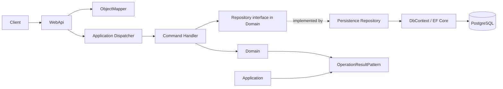

# Backend Architecture

This document explains how the backend is structured, which architectural principles it uses, and how the different parts communicate. It does not describe a specific business process. The focus is on responsibilities, dependencies, data flow, and how new requirements should be implemented.

## In Short

The backend is a .NET 8 solution divided into projects by responsibility:

- **WebApi** is the external entry point. It receives HTTP requests and returns HTTP responses.
- **Application** coordinates application actions through commands, handlers, and a dispatcher.
- **Domain** contains domain rules, models, aggregates, value objects, and interfaces.
- **Persistence** connects the domain to the database through Entity Framework Core.
- **ObjectMapper** translates between models belonging to different layers.
- **OperationResultPattern** provides a common way to return success or errors without using exceptions for expected failures.
- **Feature_Test** contains tests for the layers and their interaction.

The architecture is layered and inspired by Clean Architecture, Domain-Driven Design (DDD), and CQRS. Some of these patterns are only partially implemented at the moment. This document therefore describes both the established direction and the current implementation status.

## Overall Structure



The normal dependency direction is:

```text
WebApi -> Application -> Domain
WebApi -> Persistence -> Domain
Application -> OperationResultPattern
Domain -> OperationResultPattern
```

The Domain should be the most stable part of the system. It should not know about ASP.NET Core, HTTP, Entity Framework, or PostgreSQL. Those technical details belong in the outer layers.

## Architectural Principles

### Separation of Concerns

Each project has a defined responsibility. An endpoint should not contain database code, and a domain entity should not know about HTTP status codes. Separating responsibilities makes it possible to change one part without changing the entire system.

For example:

- An endpoint knows how to receive an HTTP request.
- A command describes the application action that should be performed.
- A handler coordinates the action.
- Domain models and domain services enforce domain rules.
- Repositories and the `DbContext` handle persistence.

### Dependency Inversion

The Application layer uses interfaces from the Domain instead of depending on concrete database implementations. Persistence implements those interfaces.

This allows application code to work with an abstraction:

```text
Application -> IRepository interface
Persistence -> Repository : IRepository interface
```

The concrete implementation is connected in `WebApi/Program.cs` through dependency injection:

```csharp
builder.Services.AddScoped<IRepository, Repository>();
```

This makes it possible to replace the database implementation or use a test double without changing the Domain or Application code.

### Domain-Driven Design

The Domain project is structured around domain concepts rather than database tables. It includes concepts such as:

- **Aggregates**, which group models and protect a consistent state.
- **Entities**, which have identity and a lifecycle.
- **Value objects**, which represent validated values with domain meaning.
- **Domain services**, for rules that do not naturally belong to one entity.
- **Domain interfaces**, which describe requirements for external resources.

An entity protects its own state through private setters, factory methods, and domain methods. Validation should therefore be close to the model that owns the rule instead of existing only in the API layer.

Value objects are used for values with special meaning. A domain identifier or an email address is not treated as arbitrary text or a random `Guid`. This creates a clearer model and keeps value validation in one place.

### CQRS-Inspired Application Layer
Install [Flox](https://flox.dev/docs/install-flox/install/) before setting up
the repository. The committed Flox environment provides the exact .NET SDK
version `8.0.406`. The root `global.json` keeps the .NET CLI on that exact
version.

The Application layer uses a command-based structure:

1. A request is translated into a command.
2. An `ICommandDispatcher` finds the matching `ICommandHandler<TCommand>`.
3. The handler performs the application action using repositories and domain models.
4. The result is returned to the API layer.

This is CQRS-inspired because each state-changing action is represented by a command with a dedicated handler. The project does not currently have a separate query side, so it should not be described as full CQRS with separate read and write models.

## Responsibilities of Each Project

The version check should print `8.0.406`. The API's HTTP and HTTPS URLs are
listed in `Backend/WebApi/Properties/launchSettings.json`; Swagger is available
at `/swagger` when the API is running in Development.

`WebApi` is the presentation layer. It contains:

- ASP.NET Core startup in `Program.cs`.
- API endpoints and controllers.
- HTTP request and response models.
- Swagger/OpenAPI configuration.
- Dependency injection registrations.

An endpoint receives an HTTP request, maps it to a command, sends the command to `ICommandDispatcher`, and maps the result to an appropriate HTTP response.

WebApi should not decide domain rules. It should not create a `DbContext` directly inside an endpoint either. Its responsibility is to act as an adapter between HTTP and the Application layer.

### Application

`Application` is the application-action layer. It contains:

- Commands that describe requested state changes.
- `ICommandHandler<TCommand>` and concrete handlers.
- `ICommandDispatcher` and the concrete dispatcher.
- Reflection-based handler registration in `DependencyInjection`.
- The planned Unit of Work decorator.

The dispatcher uses the command type to find the matching handler in the dependency injection container:

```text
SomeCommand
        |
        v
ICommandHandler<SomeCommand>
        |
        v
SomeCommandHandler
```

This means that an endpoint does not need to know the concrete handler. It only depends on `ICommandDispatcher`.

### Domain

`Domain` is the core layer. It contains rules and models that should be understandable without knowledge of web or database technology.

The Domain uses encapsulation: internal state is changed through methods that can enforce rules. Entities should be created and changed through factory methods and domain methods that return a `Result`.

The Domain also contains interfaces for external requirements. Repository interfaces belong in Domain, while their implementations belong in Persistence. This means that the core owns the contract and the infrastructure provides the technical implementation.

### Persistence

`Persistence` is the infrastructure layer for database access. It contains:

- A `DbContext`.
- Entity Framework Core configuration.
- The PostgreSQL provider through Npgsql.
- Database migrations.
- Repositories that implement Domain interfaces.

The `DbContext` describes how domain models are mapped to database tables, including column names, keys, data types, and constraints.

Repositories use the `DbContext` to read and write data. The rest of the system should use repository interfaces from the Domain instead of knowing about the Entity Framework API.

### ObjectMapper

`ObjectMapper` isolates translation between models from different layers. WebApi contains explicit mapping configurations between types such as:

```text
Request DTO -> Command
Command/result -> Response DTO
```

This prevents API models from being used directly as Domain or Application models. The API contract can therefore change without necessarily changing the command or domain model.

The mapper first looks for a registered `IMappingConfig<TIn, TOut>`. If no specific configuration exists, it has a generic JSON-based fallback. Explicit mappings are normally preferable because they make the translation visible and controllable.

### OperationResultPattern

`OperationResultPattern` contains `Result`, `Result<T>`, and `Error`. An operation can return:

- `Result.Success()` for success.
- `Result.Failure(...)` for an expected failure.
- `Result<T>.Success(value)` for success with a value.

The API layer can inspect `IsSuccess` and choose an HTTP response based on the result. Expected validation failures therefore do not need to be thrown as exceptions.

An `Error` contains a code and a message. The code is useful for clients and tests, while the message can be displayed or logged.

### Feature_Test

`Feature_Test` contains xUnit tests. Tests should work directly with the Domain and Application layers when those rules are being tested, without starting WebApi or connecting to a database.

This is one of the benefits of the layered architecture: domain rules can be tested quickly and independently from infrastructure.

## How an API Request Moves Through the System

The intended structure of a command-based request is:

```text
1. Client sends an HTTP request
          |
2. WebApi endpoint receives a request DTO
          |
3. ObjectMapper maps the DTO to a command
          |
4. ICommandDispatcher dispatches the command
          |
5. The relevant command handler performs the action
          |
6. The handler uses Domain rules and repository interfaces
          |
7. Persistence implements the repository interface with EF Core
          |
8. The result travels back through the handler and dispatcher
          |
9. WebApi maps the result to an HTTP response
```

The main types in a command flow are:

```text
Request DTO
    -> Command
    -> ICommandDispatcher
    -> CommandHandler
    -> Repository interface
    -> Repository
    -> DbContext
```

## Dependency Injection

Dependency injection assembles the system during startup in `WebApi/Program.cs`.

Typical registrations include:

- `AddDbContext<DbContext>` registers the database context.
- `AddApplication()` registers the dispatcher and discovers handlers.
- `AddMappings()` registers the mapper and mapping configurations.
- A scoped repository registration connects a Domain contract to a Persistence implementation.

`Scoped` normally means that the same instance is used during one web request. This fits `DbContext`, because a request usually needs to work within one database context.

Reflection is used to discover command handlers and mapping configurations automatically. This reduces manual registration, but it also means that a new handler must implement the correct generic interface in order to be discovered.

## Unit of Work and Transactions

Domain contains the following contract:

```csharp
public interface IUnitOfWork
{
    Task SaveChangesAsync(CancellationToken cancellationToken = default);
}
```

`UnitOfWorkCommandDispatcherDecorator` is designed to place one shared commit around a command:

1. Dispatch the command to the handler.
2. Return immediately if the result is a failure.
3. Call `SaveChangesAsync()` once if the operation succeeds.

This is useful because a handler can change multiple domain objects while the commit is performed once after the complete application action succeeds.

In the current code, the decorator registration is commented out in `Application/Extenstions/DependencyInjection.cs`. The concrete repository also calls `SaveChangesAsync` itself. Therefore, the Unit of Work principle is not yet consistently active in the runtime configuration. If the decorator is enabled, `SaveChangesAsync` should normally be moved out of individual repositories so the Application flow controls the commit point.

## Current Implementation Status

The architecture contains several clear building blocks, but they are not all complete or fully connected yet:

- `UnitOfWorkCommandDispatcherDecorator` exists, but its dependency injection registration is commented out.
- `IUnitOfWork` exists in Domain, but the current `DbContext` does not show an implementation of the interface.
- The concrete repository currently saves changes through EF Core itself.
- The existing feature tests test Domain directly and are not end-to-end HTTP tests.
- A migration and PostgreSQL configuration exist, but the database connection comes from environment variables that must be available at runtime.

This means the document describes the established architectural direction and existing components. It should not be read as a guarantee that every part of the complete request flow is fully implemented.

## How to Add New Requirements

When implementing a new requirement, use the following approach:

1. Put domain rules in Domain when they describe invariants or business rules.
2. Add a command and handler in Application when the requirement changes system state.
3. Define interfaces in Domain for external dependencies that the rule or handler needs.
4. Implement database access in Persistence.
5. Add HTTP models and endpoint-specific mappings in WebApi.
6. Return `Result` or `Result<T>` for expected failures.
7. Register new concrete services in dependency injection when they are not discovered automatically.
8. Add tests at the narrowest layer that can verify the requirement, and add broader tests when multiple layers must work together.

The most important rule is that one layer should not take over another layer's responsibility. WebApi should not contain domain logic, Domain should not contain database or HTTP code, and Persistence should not decide business rules.

## Summary

The backend is organized around a stable core and outer adapters:

- Domain owns concepts, rules, and contracts.
- Application orchestrates application actions.
- WebApi translates HTTP into Application calls.
- Persistence handles database access.
- ObjectMapper keeps models from different layers separate.
- The Result pattern makes expected failures explicit.
- Dependency injection assembles implementations during startup.

- PostgreSQL is the database system.
- EF Core migrations must be committed with the backend code.
- Connection strings and credentials must be supplied through environment-specific configuration.
- Secrets must not be committed to the repository.
- The POC should use real PostgreSQL persistence rather than only an in-memory test database.

## Local PostgreSQL with Flox

The Flox manifest includes PostgreSQL as a local-only service. Its data
directory is created under the system temporary directory when the environment
starts and removed when the last Flox activation exits normally.

Inside the activated shell, wait for PostgreSQL and apply the migrations:

```bash
pg_isready -h 127.0.0.1 -p 5432
dotnet tool restore
dotnet ef database update --project Backend/Persistence/Persistence.csproj --startup-project Backend/WebApi/WebApi.csproj
dotnet run --project Backend/WebApi/WebApi.csproj --launch-profile http
```

If you have a root `.env` file, keep its `DB_NAME` and `DB_USERNAME` aligned
with the Flox values (`ordreflow`), because `Program.cs` loads `.env` during
startup and may override the Flox variables.

The API is available at `http://localhost:5125/swagger`. Press `Ctrl+C` to
stop the API and then run `exit` to leave Flox; the PostgreSQL service stops and
its temporary data is removed. Flox cleanup is best-effort if the terminal or
machine is terminated abruptly.

## Build the API image

The default target in the root `Dockerfile` builds only the API runtime image. Deployment orchestration
is intentionally kept outside this repository, so a separate deployment
repository can compose this image with the frontend and the official PostgreSQL
image today, and Kubernetes resources later.

Build the API image from the repository root:

```bash
docker build -t ordreflow-api:local .
```

For local host-based development, copy `env.example` to an untracked `.env`
file and replace the placeholder credentials. Container orchestration should
inject the variables directly (or through its secret mechanism); `DB_HOST` must
be the PostgreSQL service DNS name inside the container network, not
`localhost`.

The container listens on port `8080` and reads `DB_HOST`, `DB_PORT`, `DB_NAME`,
`DB_USERNAME`, and `DB_PASSWORD` from its environment. The deployment repository
should provide those values and connect `DB_HOST` to the PostgreSQL service name.

The Dockerfile also exposes a `migration` build target. A separate Compose
service can build that target and run:

```text
dotnet ef database update \
  --project Backend/Persistence/Persistence.csproj \
  --startup-project Backend/WebApi/WebApi.csproj
```

```bash
docker build --target migration -t ordreflow-migrations:local .
```

